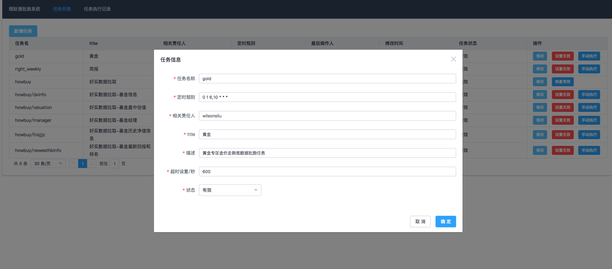
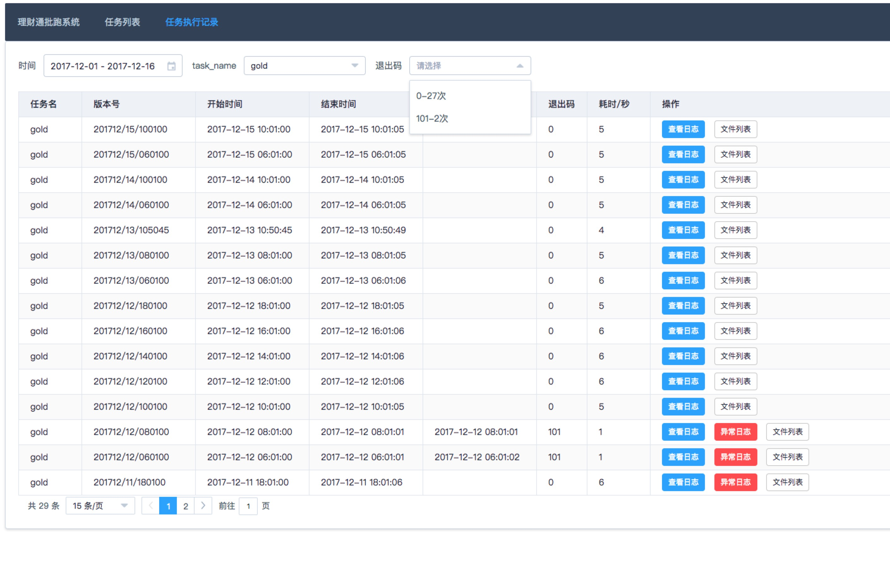

## 背景
随着node的出现与发展，前端承担了越来越多的职责。

前端也有越来越多的场景需要使用批跑脚本
- 利用爬虫或者接口定时同步数据到DB
- 线上配置文件、数据文件定时批跑生成并发布到线上

切实的影响到业务，因此需要一套高可靠与及时告警的批跑管理系统。

本文将批跑管理的系统封装为一个npm模块，可以方便使用，并且提供一套简单的web管理系统进行管理。
## 如何使用
1. 安装
```
npm install schedule_task_monitor --save
```
gihub链接 https://github.com/WilsonLiu95/schedule_task_monitor

2.  引入模块并输入参数
```
// init.js
var { run, eventEmitter, app } = require('sche_task_monitor');
run({
    mysql_config: { // mysql连接配置
        host: 'localhost',
        port: '3306',
        user: 'root',
        password: '1234',
        database: 'db_lct_schedule', // 请先建立该数据库
    },
    task_root_path: '/data/web/schedule/task/', // 任务脚本的根路径
    defaultRtx: 'wilsonsliu' // 告警默认传送对象
});
// 启动
node init.js
```
3. 启动web管理系统

web系统在8017端口打开: http://127.0.0.1:8017
```
node  ./node_mudule/sche_task_monitor/webSystem/app.js
```
4. 新建任务文件

任务名称为test，此时需要可在`/data/web/schedule/task/`新建一个test目录，并新建`/data/web/schedule/task/test/index.js`;

```
var fs = require('fs-extra');
var path = require('path');
console.log('测试啦')
fs.writeFileSync(path.join(__dirname,'publish','a.txt'),'sdsds')
```

5. web系统新增任务
在web系统新增任务，例如如下配置

```
{
    task_name: 'test',
    rule: '*/30 * * * * *',
    rtx_list: 'wilsonliuxyz@gmail.com;test@qq.com', // 告警时的相关责任人
    title: '测试',
    description: '测试描述' 
}
```
此时，批跑管理系统将按照设定的任务规则运行，每15S进行一次。

### 事件系统
模块对外暴露了`eventEmitter`，可以通过监听`task_start,task_end,notify`事件来执行用户相应的代码。
```
  eventEmitter.on('task_start', function ({ task_name, task_version }) {});
  // 任务结束
  eventEmitter.on('task_end', function ({ task_name, exit_code, task_version, error_log_list }) {});
  // 监听告警
  eventEmitter.on('notify', function ({ title, content, task_name,notify_list }) {});
}
```

### 注意的点
#### 告警模块需要自己设计
通过监听`notify`事件来实现自己的告警。用户可以自行选择自己方便的方式，最好能够通过多类方式进行告警。例如微信，邮件，邮箱等等。达到高时效

`notify`如果没有`task_name`,那么`notify_list`，则使用初始化传入的`defaultRtx`进行。
#### 发布批跑生成的文件
对于任务中生成的文件，规范放在对应的任务publish目录。实现自己的发布函数，在任务中进行调用。

#### 任务退出码 exit_code
任务正常退出 批跑模块 会接受到 `exit_code` 为0，因为异常退出会接收到 1。当退出码为非0值时，将触发告警。用户可以通过`process.exit(101)`，来触发告警

#### task_name设计
task_name唯一，且可以写为`monitor/logline`的方式，则执行路径变为`monitor/logline/index.js`。即入口文件为拼接的方式可多层级。不建议过深，不方便管理与查看。

#### 非node批跑脚本？
对于非node的批跑脚本，我们可以在入口文件中对其他脚本再次进行调用的方式进行既可以。

## 系统设计一览
### 定方向
#### 利用crontab
说到批跑，第一个想到的肯定是利用linux自带的crontab来完成定时批跑这一目的。
但依赖这种方式这样存在以下问题，
1. 每个任务都需要自行去crontab去新增一条规则，久而久之难以维护
2. 任务执行的各种告警实现困难，漏执行，超时，异常退出等等

#### 利用node开源的模块node-schedule
作为一个前端，当然是能够用JS实现的就全部就JS(node)来实现。

node本身有丰富的npm模块，`node-schedule`便是一个定时任务模块，有4300+的star。
你可以像crontab一样，编辑定时的rule，在rule指定的时间，会执行相应的回调函数。

1. 通过表t_task_list来进行管理任务，主要录入每个任务的`rule、timeout、last_start_time、last_end_time、last_warning_time`来实现任务的管理
2. 通过批跑系统统一对任务管理与监控，以便对各种任务进行告警

### 定目标
批跑系统的目的是为了管理所有的批跑任务，并且对批跑任务进行监控。
同时，因为是会直接影响到线上的系统，所以在稳定性方面有高要求。
1. 高稳定性
2. 弱侵入性(尽量减少批跑系统对相应任务的侵入)
3. 便利的基础设施服务
    - 定时运行
    - 各种异常情形下进行告警
    - 日志输出
    - 版本备份
    - 任务执行数据入库与统计

### 定规范
task的入口脚本统一放在task目录进行管理，而每个任务的关键信息`task_name、rule`等具体信息则录入表t_task_list，进行管理。

以下示例中`task_name`为gold，则批跑系统去数据库中找到`task_name=gold`这一条记录并按照，对应的`rule`进行挂在定时器，`gold/index.js`则为对应的任务入口文件，系统通过`node task/gold/index.js`执行特定任务。

```

src
├── index.js // 入口文件
├── lib
│   ├── execTask.js // 执行具体某个任务的代码
│   ├── hook.js // 开始与结束任务的钩子函数
│   ├── initDB.js // 初始化DB
│   └── monitorHelper.js // 5个监控小助手
├── webSystem // GUI的批跑管理系统
├── task // 指定该目录为任务根目录
|   └── gold // 具体某一个定时任务
|         └── index.js // 某一个任务的入口文件
|         └—— logs // 本任务留下的日志文件
│              └── 201711 // 某个月
│                  ├── 23_213854.log // 按照 day_HHmmss构建目录存放历史版本
|         └—— publish // 每次任务发布的文件夹，发布到线上需要手动调用发布函数，任务退出后批跑系统会自动将本目录下的文件备份到history目录
|         └—— history // 目录下文件按照 gold_profit.201711231015.json 即 name + time(精确到分钟) + 尾缀的形式保存
│              └── 201711 // 某一月份的历史发布文件
│                  ├── 23_213854 // 按照 day_HHmmss构建目录存放历史版本
│                  │   ├── currentYearPrice.json

```
## web管理端展示




## 系统特性的介绍与原理简介
### 高稳定性
1. 模块化、简单化。通过批跑系统模块化，并保证每个模块代码精简与健壮，以此来提高批跑系统的稳定性。
2. 批跑系统与任务隔离。批跑系统通过`child_process.spawn`子进程来运行任务，以保证批跑系统与具体任务之间进行隔离，任务的异常不会导致批跑系统的崩溃。
3. 兜底，pm2管理。任何系统都难以避免挂掉，如果系统挂掉则通过PM2自动重启任务。

### 弱侵入性
通过利用`child_process.spawn`的方式执行任务，规定`task/task_name/index.js`为任务的入口文件，相当于`node task/task_name/index.js`。

优点：
1. 批跑脚本任务代码无需做任何改造，可以选择自己喜欢的方式去编写代码。
2. 非通过`require`的方式进行引入，每次任务更新时不需要重启批跑系统，只需要部署自己的任务的代码文件即可

需要注意的2点
1. 任务不可以一直挂起，任务执行完成需退出。主要注意的检查项为mysql连接未关闭等。
2. 批跑系统通过监听任务子进程的close事件，来了解任务是否执行完成。当exit_code为非0值时，批跑系统将进行告警(关于`process.exit`可以阅读文末的参考链接3)
    - 未catch住的异常导致的退出将会吐出`exit_code=1`，`catch`住异常后，可通过`process.exit(exit_code)`来指定自己定义的`exit_code`(100以内为批跑系统保留状态码)
    - 子任务正常执行会吐出0

### 便利的基础设施服务
#### 定时运行
利用开源的`node-schedule`模块，该模块可完成类似`crontab`的功能，并且支持`crontab`的语法规则。主要用到`scheduleJob`这个接口进行定时任务挂载。

系统启动时，去数据库的`t_task_list`将所有任务的`task_name、rule`数据取出，并遍历进行挂载。同时，挂载后的句柄存储在全局对象`G_task_schedule_list`。

```
    const schedule = require('node-schedule');
    // 全局保存任务定时器的句柄 G_task_schedule_list
    G_task_schedule_list[task_name] = schedule.scheduleJob(rule, function () {
      // 回调函数中执行具体的任务
      execTask(task_name, app);
    });
```

#### 各种异常情形下进行告警
在以下5种情况时，对任务相关责任人进行告警。

1. 任务执行超时告警(`t_task_list`表中每个任务可指定超时时间为多少秒`timeout`)
2. `exit_code`非0，即异常退出
3. 漏执行告警(`cron-parser`解析`rule`得到上次应该运行时间，通过与任务的`last_start_time`比较确定是否漏执行)
4. 数据库中任务被删除通知(通过将目前挂载的任务`G_task_schedule_list`与数据库中任务进行比对，发现是否有任务被删除)
5. 批跑模块内部异常

#### 日志输出
父进程通过监听子进程的`stdout,stderr`两个输出流，得到子进程的日志输出。

日志将会存放在`task/logs/YYYYMM/DD/HHmmss.log`目录下，按照任务执行的时间存放，同时将`stderr`的信息入库(为保护批跑系统，做限制，只录入前100条)，用以在UI界面展示与告警时输出。用户如果需要详细的日志还是需要查阅日志文件。

`stderr`可以通过`console.error`输出，另外如果进程异常退出也会输出到stderr，建议在catch住异常后通过`console.error`进行输出。

#### 版本备份
每次任务执行的时候，可以将文件写入到对应任务的的`publish`目录，如果需要发布上线可以手动调用Helper中的发布函数，针对目前部分强耦合于其他系统中的发布功能，可以以接口的形式批跑调用，并在接口中返回发布的内容，任务再将其写入`publish`目录以进行版本的备份。

每次任务退出后，批跑系统会检测其`publish`是否为空，不为空则移动到`history`目录目录下，并以版本号为文件夹存储，以方便备份查看。
#### 监控小助手
批跑系统挂载一个每3S执行一次的监控小助手，达到准实时监控的效果。
1. 小助手1：已存在的任务：数据库更新rule，cancel定时任务 并设置挂载新规则的定时任务；新增任务：按照rule进行挂载
2. 小助手2：用户设置task_status为2，则杀死当前进程
3. 小助手3：根据数据库中的timeout字段，进行超时提醒
4. 小助手4：任务漏执行，告警通知
5. 小助手5：任务在数据库中被删除告警用户

#### 任务的初始化与结束
hook.js包含startExecTask, endExecTask两个函数在任务开始结束时运行。

** startExecTask 执行如下动作 **
1. 置空任务的发布文件夹 `task/task_name/publish`
2. 更新任务表中的`last_start_time,task_version`(任务的版本号根据运行时间生成`const task_version = moment().format('YYYYMM/DD/HHmmss');`)
3. 插入一条任务执行记录到`t_task_exec_list`

** endExecTask执行如下动作 ** 
1. 设置退出的事件与退出码
2. **版本备份** ：备份本次执行的发布文件夹`task/task_name/publish`到`task/task_name/history/task_version`
3. 更新任务运行记录(包括录入logs、发布的文件路径数组)

## 小结
批跑系统作为一个基础设施与其他系统最大的不同在于需要高稳定性且需要准确的监控告警以避免任务出现各种情况导致线上问题，却后知后觉。

本系统的设计基本满足了设计目标，同时提供一套便于管理的web系统，可以方便的进行任务的管理，与历史执行情况的查看。


## 参考资料
1. [node-schedule](https://github.com/node-schedule/node-schedule)
2. [解析crontab的rule规则 cron-parser](https://github.com/harrisiirak/cron-parser) 
3. [process对象与exit_code](http://javascript.ruanyifeng.com/nodejs/process.html#toc9)