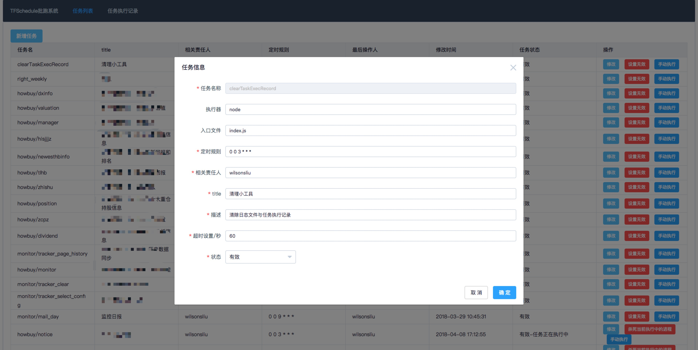
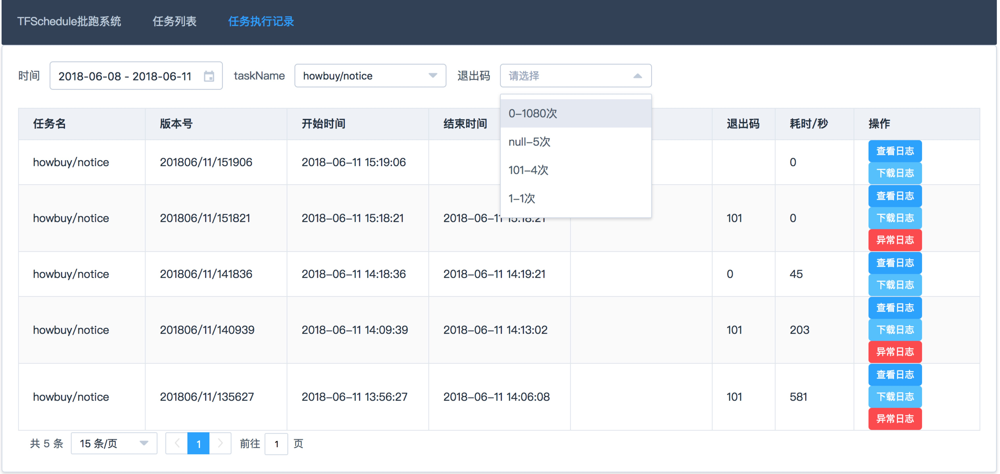
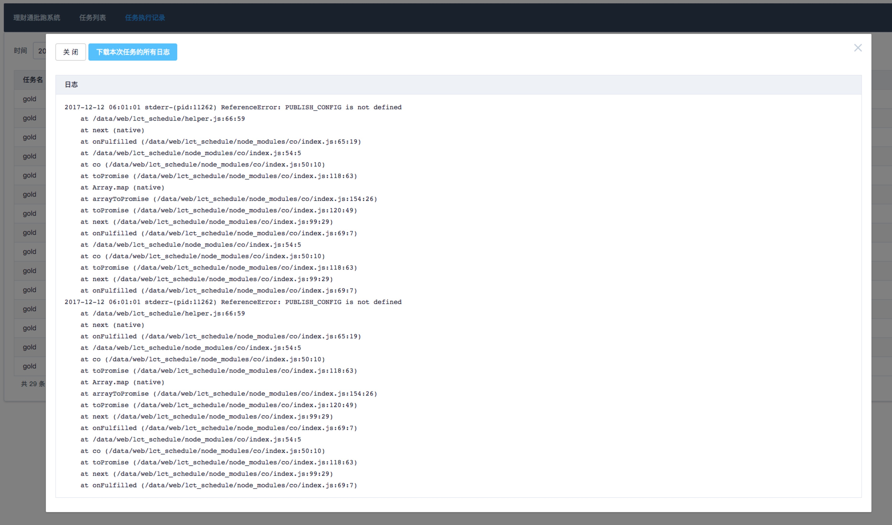
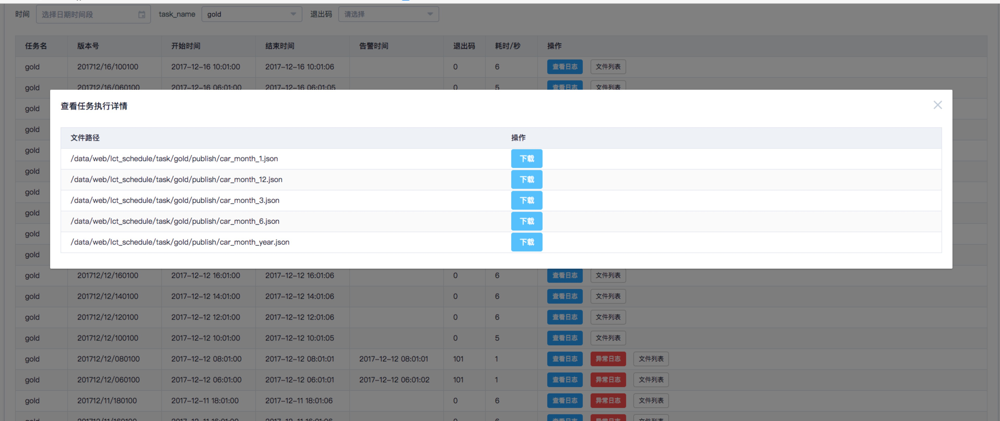

## 背景
随着node的出现与发展，前端承担了越来越多的职责。

前端也有越来越多的场景需要使用批跑脚本
- 利用爬虫或者接口定时同步数据
- 线上配置文件、数据文件定时批跑生成并发布到线上

切实的影响到业务，因此需要一套高可靠与及时告警的批跑管理系统。

node本身有丰富的npm模块，本模块的定时执行依赖于`node-schedule`模块(star 4300+)。

------
## 特性
1. 高稳定性 (子进程调用任务，异常隔离)
2. 弱侵入性 (任务迁移无改造成本)
3. 可视化的web管理端 (任务与任务执行记录入库可视化管理,原理crontab管理烦恼)
4. 便利的基础设施服务
    - 秒级定时批跑执行
    - 多语言支持 支持指定 **执行器(node,bin/sh,php等)** & **入口文件 (index.js, test.sh, index.php等)**
    - 9类任务级别异常与敏感操作告警 & 框架执行异常告警
    - 任务执行产生的 日志文件&发布的文件 根据版本(YYYYMM/DD/HHMMSS)备份

------
## 接入使用
### demo
可直接参见 example 目录下的例子(因为本系统为node编写而成，运行请先准备好node环境)

1. 安装
```shell
npm install tfschedule --save
```

2.  引入模块并输入参数

```javascript
    // example/init.js
    var { TFSchedule } = require('tfschedule');
    var scheHandle = new TFSchedule({
        backExecRecordNum: 15, //  默认保存30天的任务执行记录，任务执行记录包括日志文件，发布文件的备份，执行记录的备份(存储在数据库中)
        mysqlConfig: { // mysql连接配置
            host: 'localhost',
            port: '3306',
            user: 'root',
            password: '1234',
            database: 'db_schedule' // 请先建立该数据库
        },
        taskRootPath: __dirname + '/task', // 任务脚本的根路径
        notifyList: 'wilsonsliuxyz@gmail.com',  // 默认的告警人员列表
    });
    // shell下执行运行
    node example/init.js
```
3. 启动web管理系统
web系统在8017端口打开: http://127.0.0.1:8017 推荐批跑与web系统分开启动，以避免互相影响。
部署到线上时建议通过ningx或者apapche配置反向代理，将某个前缀路径配置到本系统的端口。

```javascript
    // example/initweb.js
    var { runWeb,webApp } = require('tfschedule');

    runWeb({
        mysqlConfig: {
            host: 'localhost',
            port: '3306',
            user: 'root',
            password: '1234',
            database: 'db_schedule'
        },
        taskRootPath: __dirname + '/task',
        port: 8017,
        oauthLogin: function () { // 授权登录的函数
            var MOCK_USER;
            if (process.env.NODE_ENV === 'production') {} else {
                MOCK_USER = {
                    LoginName: 'wilsonsliu', // 会读取此字段，记录相关人员使用web系统对任务进行的操作
                    ChineseName: '刘盛'
                };
                webApp.use(function (req, res, next) {
                    if (!res.locals) {res.locals = {};}
                    res.locals.userInfo = MOCK_USER;
                    next();
                });
            }
        }
    });

    // shell下运行，启动web系统
    node example/initweb.js
```
4. 新建任务文件
`example/task`目录下有个`demo`文件夹，以`demo/node`为例。

```javascript
    var fs = require('fs-extra');
    var path = require('path');
    console.log('测试啦');
    fs.writeFileSync(path.join(__dirname,'publish','a.txt'),'sdsds'); // 写入publish目录，可自动备份版本
```

5. web系统新增任务
在web系统新增任务，例如如下配置。此时，批跑管理系统将按照设定的任务规则运行，每30S进行一次。

```javascript
    {
        taskName: 'demo/node',
        rule: '*/30 * * * * *',
        owner: 'wilsonliuxyz@gmail.com;test@qq.com', // 告警时的相关责任人
        title: '测试',
        description: '测试描述'
        command: 'node',
        entryFile: 'index.js',
    }
```

### 使用规范与细节
#### taskName && command && entryFile
`TFSchedule`规范任务名`taskName`唯一，一旦添加后，不建议更改(web端不提供入口)。

`taskName`为任务与`taskRootPath`的相对路径，建议最多不超过2级，否则不方便管理与查看，例如写为`demo/node`的方式，则执行路径变为`demo/node/index.js`。

`command`即为任务的执行器，如果不设定则以 `new TFSchedule(option)`时传入的`command`为准。

`entryFile`即为任务入口文件，如果不设定则以 `new TFSchedule(option)`时传入的`entryFile`为准。

通过给任务指定不同的执行器与入口文件，我们可以将运行任何类型的语言任务。

#### 任务退出码 exitCode
`TFSchedule`会监听子进程的`close`事件，`close`事件有2个参数`exitCode, signalCode`。

`exitCode`即为退出码,当任务正常退出，则 `exitCode` 为0,进程因为未捕获的异常导致退出会接收到1。
在此之上，如果想手动执行退出，可调用`process.exit(exitCode)`,建议通过自定义退出码达到更多的传送信息的目的。
目前建议使用100以上的退出码，0与1为node进程规范使用，2-100为TFSchedule预留的异常码。

`singnalCode`为 `process.kill(signalCode)`传入，web系统下手动杀死执行中的任务即是调用这个方法进行杀死，手动杀死的异常码设置为2。

`TFSchedule`监听到非0的退出码会触发异常退出 `closeError` 告警，如果接收到`signalCode`会触发`killTask`敏感操作告警。

另外，存在`exitCode`为null的情况，即当任务尚在执行 or 任务进行中时遇到TFSchedule重启导致不再更新任务执行数据。
**任务运行完，请及时退出**
1. 避免类似`express`一样起一个服务导致不退出
2. 避免mysql连接未退出造成任务不退出

#### 事件系统
`TFSchedule`继承了`events.EventEmitter`，目前暴露了如下事件可以绑定回调函数。

```javascript
  TFSchedule.on('runTask', (taskName) => {});
  TFSchedule.on('taskStart', function ({ taskName, taskVersion }) {});
  TFSchedule.on('taskEnd', function ({ taskName, exitCode, taskVersion, errorLogList }) {});

  TFSchedule.on('taskLevelNotify', function({ type, title, content, taskName }){}); // type 即为 任务告警类型
  TFSchedule.on('systemError', function ({ errMsg, error }) {});
  // 告警最终将会通过 notify 事件触发，用户可以监听 notify 事件，在回调中调用自己的告警方法实现告警
  TFSchedule.on('notify', function ({ title, content,notifyList }) {});
}
```

------
## 系统设计与实现介绍
### 目录结构
以demo为例，`task`为任务的根目录，将所有任务集中在此目录下，每个任务的关键信息`taskName、rule`等则录入表`t_task_list`进行管理。

批跑系统去数据库中加载任务，遍历挂载执行。

`taskName=demo/node`这一条记录按照数据库中对应的`rule`进行挂在定时器，`demo/node/index.js`则为对应的任务入口文件，系统通过`node task/demo/node/index.js`执行任务。

```shell
├── example
│   ├── init.js // 初始化批跑系统
│   ├── initweb.js // 初始化批跑系统的web管理系统
│   └── task // 任务根路径
│       └── clearTaskExecRecord // 系统添加的任务：清理小助手，清理过期数据与文件
│       └── demo // demo测试
|           ├── shell // shell版本的demo
|           ├── node // node版本的demo
│               ├── history // 存放历史发布文件的版本
│               │   └── 201805 // 年月
│               │       └── 07 // 日期
│               │           ├── 123015 // HHmmss 精确到秒
│               │           │   └── gold_rate.json
│               ├── index.js // 任务执行文件，即 node index.js
│               ├── logs // 历史执行日志输出
│               │   └── 201805
│               │       └── 07
│               │           ├── 123015.log // 2018年5月7号12:30:15执行任务时，输出的日志
│               └── publish // 发布文件目录
│                   └── a.txt
└── src // 批跑系统源代码
    ├── index.js // 入口文件
    ├── lib // 库函数
    │   ├── execTask.js // 任务执行相关的函数
    │   ├── hook.js // 钩子函数 即 startExecTask, endExecTask 开始与结束时执行的函数
    │   ├── tpl.js // 保存数据库建表sql语句,以及任务clearTaskExecRecord的代码模版
    │   └── monitorHelper.js // 5个监控小助手
    │   ├── bindEvent.js // 绑定事件
    ├── public
    │   ├── index.html // web系统首页
    │   ├── lib // 依赖模块
    │   └── record.html // 执行记录页面
    └── webapp.js // web系统的入口文件

```

### 高稳定性
1. 模块化,通用逻辑抽离
2. 强化异常逻辑处理，并进行异常告警`SystemError`
3. 子进程调用任务，异常隔离
4. 兜底，pm2调用。任何系统都难以避免挂掉，如果系统挂掉则通过PM2自动重启任务。

### 弱侵入性
摒弃通过node`require`的方式加载对应的任务脚本，而是通过利用node子进程`child_process.spawn`的方式执行任务。并可以自己指定执行器与入口文件。

1. 批跑脚本任务代码无需做任何改造，可以选择自己喜欢的方式去编写代码。
2. 非通过`node`的`require`的方式进行引入，每次任务更新时不需要重启批跑系统，只需要部署自己的任务的代码文件即可
3. 多语言支持，而非仅能支持node

### 可视化的web管理端
1. 通过表`t_task_list`来进行管理任务，主要录入每个任务的`rule、timeout、lastStartTime、lastEndTime、lastWarningTime`来实现任务的管理
2. 通过表`t_task_exec_list`来记录任务执行记录，录入每一次执行过程的相关信息`taskName,taskVersion,startTime,endTime,exitCode,warningTime,duration,errorLogs,publishFileList`
3. 通过可视化的WEB系统对任务以及执行记录进行管理






### 便利的基础设施服务
#### 1. 秒级定时批跑执行
利用开源的`node-schedule`模块，该模块可完成类似`crontab`的功能，并且支持`crontab`的语法规则。主要用到`scheduleJob`这个接口进行定时任务挂载。

系统启动时，去数据库的`t_task_list`将所有任务的`taskName、rule`数据取出，并遍历进行挂载。同时，挂载后的句柄存储在`scheduleJobs`中。

```javascript
    const {scheduleJob, scheduleJobs} = require('node-schedule');
    // 定时器的句柄会保存在scheduleJobs
    scheduleJob('test_node', '*/10 * * * * *', function () {
      // 触发 runTask事件，传送任务名称。 bindEvent.js中对runTask事件进行处理执行任务
      this.emit('runTask', taskName);
    });
```

#### 2. 9类任务级别异常与敏感操作告警 & 框架执行异常告警
- 任务级别的异常 taskLevelNotify
    1. `entryFileIsNotExists` 任务指定的入口文件不存在
    2. `lastJobHasNotEnd` 同一个任务的上次尚在执行未退出
    3. `closeError` `exitCode`非0，即异常退出
    4. `outtimeTask` 任务执行超时告警(`t_task_list`表中每个任务可指定超时时间为多少秒`timeout`)
    5. `missrunTask` 漏执行告警(`cron-parser`解析`rule`得到上次应该运行时间，通过与任务的`lastStartTime`比较确定是否漏执行)
- 任务级别的敏感操作 taskLevelNotify
    1. `killTask` 任务在web系统主动杀死
    2. `addTask` 添加新任务
    3. `modifyTask` 任务运行规则修改
    4. `taskDelete` 数据库中任务被删除通知,理论上不允许删除操作(通过将目前挂载的任务`scheduleJobs`与数据库中任务进行比对，发现是否有任务被删除)
- `TFSchedule`内被捕获的异常 `systemError`
- `TFSchedule`系统启动通知 `notify`

#### 3. 日志输出
父进程通过监听子进程的`stdout,stderr`两个输出流，得到子进程的日志输出。

日志将会存放在`task/logs/YYYYMM/DD/HHmmss.log`目录下，按照任务执行的时间存放，同时将`stderr`的信息入库(为保护批跑系统，做限制，只录入前50条)，用以在UI界面展示与告警时输出。用户如果需要详细的日志还是需要查阅整个日志文件。

node中`stderr`可以通过`console.error`输出。另外如果进程异常退出也会输出到stderr，建议在`catch`住异常后通过`console.error`进行输出，再对异常进行处理。

#### 4. 版本备份
除了日志以外，任务的执行过程中可能会产生一系列的文件，对于这些文件往往也也有进行版本备份的诉求。

每次任务执行的时候，可以将文件写入到对应任务的的`publish`目录，任务退出时，批跑系统会检测其`publish`是否为空，不为空则移动到`history/YYYYMM/DD/HHmmss/`目录下，并以版本号为文件夹存储，以方便备份查看。

建议：如果需要将文件发布上线可写一个通用模块方法进行调用

#### 5. 监控小助手
`TFSchedule`挂载一个每3S执行一次的监控小助手，达到准实时监控的效果。

- 小助手1：已存在的任务：数据库更新rule，cancel定时任务 并设置挂载新规则的定时任务；新增任务：按照rule进行挂载 `addTask,modifyTask`
- 小助手2：用户设置`taskStatus`为2，则杀死当前进程,并更新`taskStatus`为1即任务无效 `killTask`
- 小助手3：根据数据库中的timeout字段，进行超时提醒`outtimeTask`
- 小助手4：任务漏执行，触发`missrunTask`
- 小助手5：任务在数据库中被删除告警系统管理员`deleteTask`

#### 6. 任务的初始化与结束
hook.js包含startExecTask, endExecTask两个函数在任务开始结束时运行。

startExecTask 执行如下动作
- 置空任务的发布文件夹 `task/taskName/publish`
- 更新任务表中的`lastStartTime,taskVersion`(任务的版本号根据运行时间生成`const taskVersion = moment().format('YYYYMM/DD/HHmmss');`)
- 插入一条任务执行记录到`t_task_exec_list`

endExecTask执行如下动作
- 设置退出的事件与退出码
- **版本备份** ：备份本次执行的发布文件夹`task/taskName/publish`到`task/taskName/history/taskVersion`
- 更新任务运行记录(包括录入logs、发布的文件路径数组)

------
## 参考资料
1. [node-schedule](https://github.com/node-schedule/node-schedule)
2. [解析crontab的rule规则 cron-parser](https://github.com/harrisiirak/cron-parser)
3. [process对象与exitCode](http://javascript.ruanyifeng.com/nodejs/process.html#toc9)
